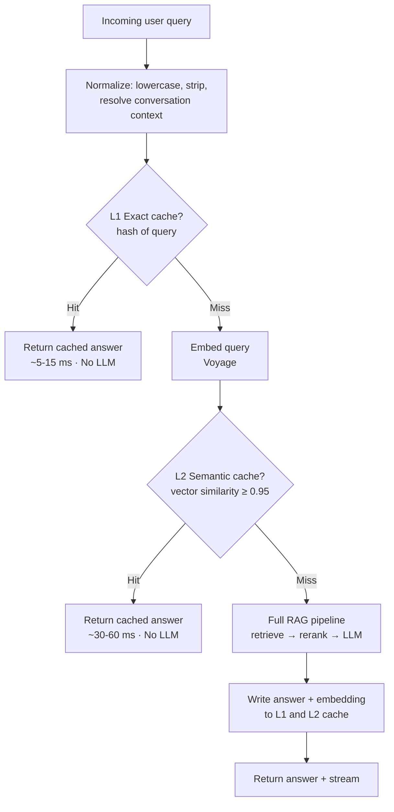
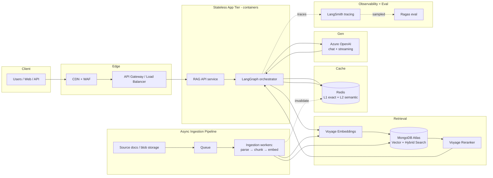
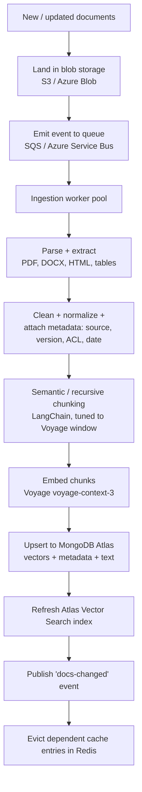
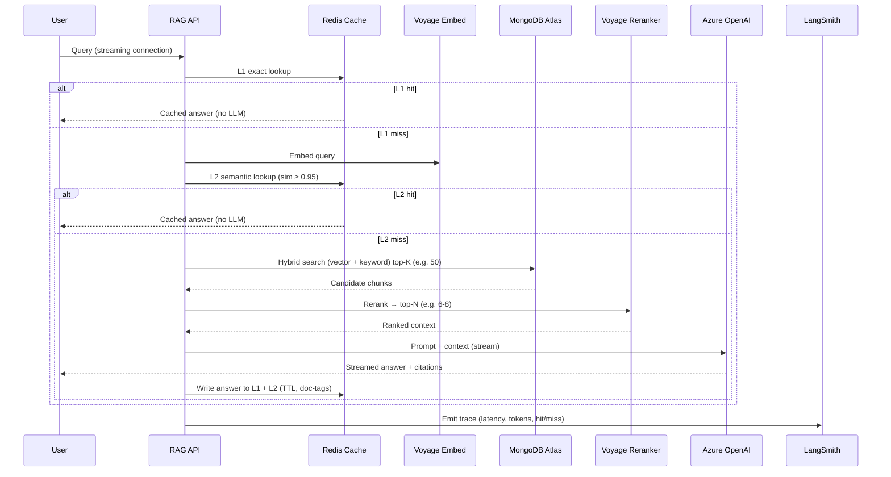
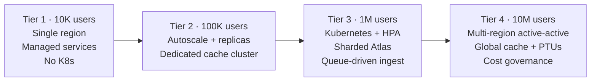

# Production-Ready RAG — Architecture & Scaling Plan

**Application type:** Document analysis / research assistant
**Corpus:** Medium (10K–500K documents), periodic batch updates
**Latency target:** Real-time, chat-like (< 2s perceived, streaming)
**Hard rule:** If multiple users ask a similar question, serve from cache — **do not call the LLM**.

**Locked stack:** Azure OpenAI (LLM) · Voyage AI (embeddings/chunking) · Voyage Reranker · Redis (cache) · MongoDB Atlas Vector Search (VectorDB) · LangChain + LangGraph + LangSmith + Ragas · Docker/Kubernetes (only where it earns its place).

---

## 0. One important clarification on the stack

Voyage AI is an **embedding + reranking** provider — it does not itself "split" text. So I've designed it as:

- **Splitting (chunking):** LangChain semantic/recursive splitters, tuned to Voyage's context window.
- **Embedding:** Voyage `voyage-3` family (use `voyage-context-3` for contextualized chunk embeddings — ideal for research documents where chunk-in-document context matters).
- **Reranking:** Voyage `rerank-2.5` on the top-N candidates before generation.

If you actually meant a Voyage-specific chunking tool, tell me and I'll adjust — but the above is the production-correct interpretation.

---

## 1. Design principles (apply at every scale)

1. **Cache before compute.** Every request hits the cache layer first. The LLM is the most expensive, slowest hop — it is the *last resort*, not the default.
2. **Separate the two pipelines.** *Ingestion* (write path, batch, async) and *Query* (read path, real-time) scale independently and must never block each other.
3. **Stateless app tier.** All state lives in MongoDB Atlas, Redis, and blob storage. App containers are disposable → horizontal scaling is trivial.
4. **Everything is observable.** LangSmith traces every chain; Ragas scores retrieval/answer quality continuously. You cannot scale what you cannot measure.
5. **Cloud-portable core.** Business logic is identical on AWS and Azure; only the *managed services around it* swap. (Hence the two sections in §7.)

---

## 2. The two-layer semantic cache (the heart of your requirement)

This is what guarantees "similar questions don't call the LLM."



**How it works**

- **L1 — Exact-match cache (Redis string/hash).** Key = hash of the normalized query (+ filters + user-scope where relevant). Instant, near-zero cost. Catches identical repeats.
- **L2 — Semantic cache (Redis Vector or a dedicated cache collection).** Embed the query with Voyage, search the cache of previously-answered `{question_embedding → answer}`. If cosine similarity ≥ a tuned threshold (start at 0.95; lower = more hits but more risk of a wrong reuse), return the stored answer. **No LLM call.**
- **Cache write.** Every freshly generated answer is written back to both layers with a TTL.
- **Invalidation (critical for a research assistant where correctness matters):**
  - Tag every cached answer with the **source-document IDs / version** it was built from.
  - When the ingestion pipeline updates or deletes those documents, **evict the dependent cache entries** (event-driven invalidation via a pub/sub message on re-index).
  - Apply a conservative TTL (e.g., 24h) as a safety net so stale answers age out even if an invalidation event is missed.
- **Safety:** keep the threshold high for a research/citations use case. A semantic cache hit must include the **same citations**; if a user asks for a different document scope/filter, treat it as a cache miss.

**Why this matters at scale:** at 1M+ users a 40–70% cache hit ratio is realistic for a research assistant with overlapping questions. That directly cuts Azure OpenAI token spend and is the single biggest lever on both **cost** and **p95 latency**.

### 2.1 Worked example — matching *meaning*, not *words*

The whole point: "How much?" and "What is the price?" share **no keywords** but mean the same thing. Keyword matching fails here; **embedding similarity** catches it, because semantically equivalent questions land close together in vector space.

```
"How much is Product A?"          → embed → vector V1
"What is the price of Product A?" → embed → vector V2
cosine_similarity(V1, V2) ≈ 0.96  → above threshold → return same answer (no LLM)
```

So the *first* user to ask "How much is Product A?" pays for one LLM call; everyone after — "what's the price," "cost of A?", "how much for A" — gets the cached answer in milliseconds.

**Step-by-step matching logic (the L2 path)**

1. **Normalize + resolve context (critical).** Turn the raw query into a self-contained question *before* embedding. "How much?" alone is ambiguous — price of *what?* — so pull in conversation context and resolve it to "What is the price of Product A?". Embed the **resolved** question, not the fragment. Skipping this is the #1 reason short questions fail to match.
2. **Embed** the normalized query with Voyage (same model used to store entries).
3. **Vector-search the Redis cache index** (KNN, cosine) → nearest stored question + similarity score.
4. **Decide:** if similarity ≥ threshold → **cache hit, return stored answer, no LLM**; else **miss** → run full RAG, then **write {embedding, answer, doc-tags, scope, TTL} back** so the next similar question hits.

**Threshold = your main tuning knob**

- **0.97+** = stricter: fewer hits, near-zero risk of a wrong reuse.
- **0.90** = more hits and more LLM savings, but rising risk two *different* questions collapse into one answer.
- For a research/citations use case, stay strict (**0.95–0.97**); tune against LangSmith near-miss logs and validate with Ragas.

**Match / no-match illustration**

| Stored question | New question | ~Similarity | Result |
|---|---|---|---|
| "What is the price of Product A?" | "How much is Product A?" | 0.96 | ✅ Cache hit — no LLM |
| "What is the price of Product A?" | "What's the cost of A?" | 0.95 | ✅ Cache hit — no LLM |
| "What is the price of Product A?" | "What is the price of Product B?" | 0.88 | ❌ Miss — different subject → LLM |
| "What is the price of Product A?" | "Is Product A in stock?" | 0.71 | ❌ Miss — different intent → LLM |

The last two rows are why the threshold exists: it stops genuinely different questions from sharing one cached answer.

**Three guardrails you must not skip**

1. **Resolve context before embedding** (step 1) — or ambiguous short questions mismatch.
2. **Scope the cache** — if different users/tenants see different documents, include the user/permission scope in the cache entry so User B never gets an answer built from documents only User A can see.
3. **Invalidate on document change** — evict every cache entry tagged with a document's ID when ingestion updates it, so a changed price doesn't keep serving the old value.

---

## 3. End-to-end architecture (logical, cloud-agnostic)



---

## 4. Pipeline 1 — Ingestion & Indexing (write path, async)

Runs as a separate service from the query API so heavy re-indexing never degrades live latency.



**Key decisions**

- **Idempotent upserts** keyed by `document_id + chunk_index + content_hash` so re-running a batch never duplicates vectors.
- **Versioning:** keep `doc_version`; on update, upsert new chunks and tombstone old ones, then fire cache invalidation for affected `document_id`s.
- **Chunking for research docs:** semantic chunking with overlap, preserve section/heading metadata and page numbers so the LLM can **cite precisely**.
- **Contextual embeddings:** `voyage-context-3` embeds each chunk with awareness of surrounding document context → materially better retrieval for long research documents.
- **Scheduling:** periodic batch (your corpus updates periodically) via a scheduled trigger; same path also handles ad-hoc uploads.
- **Backfill / re-embedding:** if you change embedding models, run a versioned re-index into a *new* Atlas index, then cut over (blue/green) — never mutate the live index in place.

---

## 5. Pipeline 2 — Query / Retrieval (read path, real-time, < 2s)



**Orchestration with LangGraph**

Model the read path as a small state graph, not a linear chain:

- Nodes: `normalize → cache_check → retrieve → rerank → generate → cache_write`.
- Conditional edges short-circuit to "return" on cache hits.
- A **"deep mode" branch** (optional, for hard research questions): multi-step retrieve → reason → re-retrieve loop. This branch intentionally exceeds 2s and should be triggered explicitly (a "deep search" toggle), so your default path stays fast.

**Hitting < 2s perceived latency**

- **Streaming first token** — show tokens as Azure OpenAI generates; perceived latency is time-to-first-token, not full completion.
- **Cache hits** return in tens of milliseconds (the majority of traffic at scale).
- **Bounded reranking** — retrieve top-50, rerank to ~6–8. Reranking is fast and dramatically improves answer quality (key for citations).
- **Parallelize** embedding + any metadata pre-filters.
- Keep prompts tight; use a smaller/faster Azure OpenAI deployment for the default path and reserve a larger model for deep mode.

**Evaluation loop**

- **LangSmith** traces 100% of requests (sample in prod) — latency, token cost, cache hit ratio, retrieval scores.
- **Ragas** runs offline + on sampled live traffic: context precision/recall, faithfulness, answer relevancy. Wire it into CI so every prompt/chunking/model change is regression-tested before release. This is your guardrail that the semantic cache and reranking aren't quietly degrading quality.

---

## 6. Scaling plan — 10K → 100K → 1M → 10M users

Assumptions: "users" = registered users; what actually sizes infra is **peak concurrent requests** and **QPS**. Rough planning ratios below (tune with real telemetry). The cache hit ratio is your best friend — it climbs as the user base grows and questions overlap.



### Tier 1 — 10,000 users (MVP / launch)
- **Goal:** ship correctly, measure everything. Keep ops simple.
- **App tier:** managed container service (no Kubernetes yet) — 2+ instances behind a load balancer for HA.
- **VectorDB:** MongoDB Atlas dedicated tier (e.g., M10/M20), single region, Vector Search enabled.
- **Cache:** small managed Redis (single primary + replica). Stand up **both** L1 and L2 from day one — this is your core requirement, not an optimization.
- **LLM:** Azure OpenAI standard (pay-as-you-go) deployment.
- **Ingestion:** scheduled batch worker + queue; can be a single worker.
- **Observability:** LangSmith + Ragas wired in from the start.
- **Focus:** establish the cache-hit baseline and quality scores. Don't over-build.

### Tier 2 — 100,000 users
- **App tier:** autoscaling group (scale on CPU + concurrent requests); still managed containers or light Kubernetes if your team already runs it.
- **VectorDB:** scale Atlas up (M30/M40), add **read replicas**; consider dedicated **Search Nodes** so vector queries don't compete with operational load.
- **Cache:** dedicated Redis cluster with replicas; tune TTLs; monitor hit ratio (target 30–50%+). Add request-level coalescing (dedupe identical in-flight queries).
- **LLM:** add a faster/cheaper deployment for the default path; keep a larger one for deep mode. Implement token budgets + rate limiting per user.
- **Ingestion:** worker pool autoscaled off queue depth.
- **Edge:** add CDN + WAF; API gateway with rate limiting and auth.

### Tier 3 — 1,000,000 users
- **App tier:** **Kubernetes now earns its place** — HPA on custom metrics (QPS, queue depth), pod disruption budgets, rolling deploys. Separate node pools for API vs ingestion workers.
- **VectorDB:** **shard** Atlas; dedicated Search Nodes scaled out; multi-AZ. Partition strategy by tenant/collection if multi-tenant. Consider read routing to nearest region for global users.
- **Cache:** large clustered Redis, possibly multi-AZ with replicas; semantic-cache hit ratio becomes a primary cost lever (target 50%+). Pre-warm cache for known-popular queries.
- **LLM:** move to **Azure OpenAI Provisioned Throughput (PTUs)** for predictable latency/cost on the hot path; spillover to pay-as-you-go for bursts.
- **Ingestion:** fully event-driven, parallel workers, dead-letter queues, backpressure.
- **Resilience:** circuit breakers around Voyage/Azure OpenAI, retries with backoff, graceful degradation (serve cached/abstractive answer if LLM is saturated).

### Tier 4 — 10,000,000 users
- **Topology:** **multi-region active-active.** Route users to nearest region; each region runs the full read path.
- **VectorDB:** Atlas global clusters / per-region read replicas; heavy sharding + dedicated Search Nodes; tiered storage for cold documents.
- **Cache:** **global, multi-region cache** with regional Redis clusters; replicate/route semantic cache so a hit in one region is reusable; this is where the "no-LLM-for-similar-questions" rule saves the most money. Target the highest sustainable hit ratio.
- **LLM:** multiple PTU pools across regions; quota management; possibly multiple Azure OpenAI deployments for failover. Aggressive cache + reranking keep token spend bounded.
- **Governance:** cost dashboards (token spend, cache savings), per-tenant quotas, SLO-based autoscaling, chaos/failover testing, blue-green index cutovers.
- **Data pipeline:** streaming-capable ingestion if update frequency rises; isolated re-index clusters.

**Capacity-planning checklist (re-evaluate at every tier):**
peak concurrent requests · QPS · cache hit ratio · Atlas vector query p95 · reranker latency · Azure OpenAI tokens/min vs quota/PTU · ingestion throughput vs backlog.

---

## 7. Cloud service mapping

The application core (LangChain/LangGraph code, Voyage calls, Azure OpenAI calls, MongoDB Atlas, Redis) is **identical** on both clouds. Only the surrounding managed infrastructure differs. Note: **MongoDB Atlas, Voyage AI, and Azure OpenAI are used on both clouds** (Atlas runs on AWS/Azure/GCP; Voyage is SaaS; Azure OpenAI is Azure-hosted but callable from AWS over the internet/private link).

### SECTION A — AWS Implementation

| Component | AWS service |
|---|---|
| Edge / CDN / WAF | CloudFront + AWS WAF |
| API gateway / auth | Amazon API Gateway + Cognito (or your IdP) |
| Load balancing | Application Load Balancer |
| App tier (T1–T2) | ECS Fargate (serverless containers) |
| App tier (T3–T4) | Amazon EKS (Kubernetes) with HPA + Cluster Autoscaler/Karpenter |
| Ingestion queue | Amazon SQS (+ SNS for fan-out / invalidation events) |
| Ingestion workers | ECS Fargate / EKS jobs, autoscaled on queue depth |
| Object storage (raw docs) | Amazon S3 |
| Cache (L1 + L2 semantic) | Amazon ElastiCache for Redis (cluster mode at scale) |
| Vector database | **MongoDB Atlas on AWS** (VPC peering / PrivateLink) |
| Embeddings & reranker | **Voyage AI** (SaaS API; egress via NAT/PrivateLink) |
| LLM | **Azure OpenAI** (called cross-cloud; secure via private endpoint/egress controls) |
| Secrets | AWS Secrets Manager |
| Scheduling (batch ingest) | EventBridge Scheduler |
| Observability (infra) | CloudWatch + X-Ray |
| Observability (RAG) | **LangSmith** + **Ragas** |
| CI/CD | CodePipeline / GitHub Actions → ECR |

**AWS notes:** Start on Fargate (no cluster to manage) and only adopt EKS at Tier 3 when you need fine-grained autoscaling and node pools. Use PrivateLink to MongoDB Atlas to keep vector traffic off the public internet.

### SECTION B — Azure Implementation

| Component | Azure service |
|---|---|
| Edge / CDN / WAF | Azure Front Door + WAF |
| API gateway / auth | Azure API Management + Entra ID |
| Load balancing | Azure Load Balancer / Front Door |
| App tier (T1–T2) | Azure Container Apps (serverless containers) |
| App tier (T3–T4) | Azure Kubernetes Service (AKS) with HPA + KEDA |
| Ingestion queue | Azure Service Bus (+ Event Grid for invalidation events) |
| Ingestion workers | Container Apps Jobs / AKS + KEDA (scale on queue) |
| Object storage (raw docs) | Azure Blob Storage |
| Cache (L1 + L2 semantic) | Azure Cache for Redis (Enterprise tier for clustering/vector) |
| Vector database | **MongoDB Atlas on Azure** (VNet peering / Private Link) |
| Embeddings & reranker | **Voyage AI** (SaaS API) |
| LLM | **Azure OpenAI** (native — Private Link, lowest latency here) |
| Secrets | Azure Key Vault |
| Scheduling (batch ingest) | Azure Logic Apps / Container Apps cron jobs |
| Observability (infra) | Azure Monitor + Application Insights |
| Observability (RAG) | **LangSmith** + **Ragas** |
| CI/CD | Azure DevOps / GitHub Actions → Azure Container Registry |

**Azure notes:** This is the **lower-latency / simpler-compliance choice** because Azure OpenAI is native — keep the app tier in the same Azure region as your Azure OpenAI deployment to minimize LLM round-trip time, which directly helps your < 2s target. Container Apps covers you through Tier 2; move to AKS at Tier 3.

---

## 8. Docker / Kubernetes — when to introduce

- **Docker:** from **day one** — containerize the API and ingestion services so they're portable and reproducible.
- **Kubernetes:** **not** at Tier 1–2. Managed serverless containers (Fargate / Container Apps) are cheaper and lower-ops. Introduce **EKS/AKS at Tier 3 (1M users)** when you need custom-metric autoscaling, separate node pools, and fine-grained rollout control. Adopting K8s earlier mostly buys you operational overhead with little benefit.

---

## 9. Recommended build sequence

1. **Foundation:** containerize app; stand up MongoDB Atlas + Vector Search; provision Redis.
2. **Ingestion pipeline:** blob storage → queue → parse → chunk (LangChain) → embed (Voyage `voyage-context-3`) → upsert Atlas. Make it idempotent + versioned.
3. **Query pipeline (LangGraph):** normalize → **cache check (L1+L2)** → hybrid retrieve → Voyage rerank → Azure OpenAI (streaming) → cache write.
4. **Semantic cache hardening:** tune similarity threshold, doc-tag invalidation, TTLs. Validate "similar question → no LLM call" with real traffic.
5. **Observability + eval:** LangSmith tracing, Ragas in CI, dashboards for cache hit ratio / latency / token spend.
6. **Load-test & set SLOs**, then scale per the tier plan.
7. **Cloud:** pick AWS or Azure (Azure recommended given Azure OpenAI is native), deploy via the §7 mapping.

---

## 10. Open questions for you

1. **Multi-tenancy / access control?** Do different users see different documents? (Affects Atlas filtering, cache key scoping, and whether a cache hit can be shared across users.)
2. **Citations strictness** — do answers must always cite source + page? (I've assumed yes for a research assistant.)
3. **Update frequency & corpus end-state** — periodic = daily? weekly? And where do the 10K–500K docs top out? (Affects re-index strategy.)
4. **Single cloud or true multi-cloud?** The plan supports both, but committing to one (I'd suggest **Azure**, since Azure OpenAI is native) simplifies networking and latency.
5. **Conversation memory** — is this single-shot Q&A or multi-turn chat with history? (Affects cache keying and the LangGraph state.)
6. **Voyage "text splitting"** — confirm you're OK with LangChain doing chunking + Voyage doing embeddings/reranking (Voyage has no standalone splitter).

Answer these and I'll tighten the plan (sizing numbers, exact Atlas tiers, cache thresholds, and a per-tier cost model).
